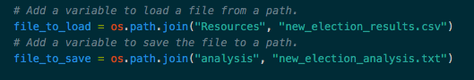

# Election_Analysis

## Overview of Election Audit
The task was to analyze the election results and create a summary using python. A csv file that listed all candidate votes by county was provided. Once the code was completed, we were able to get a text file with the election results. 

## Election-Audit Results
- 369,711 votes were cast in this congressional election.
- Breakdown of votes per county: Jefferson 10.5%, Denver 82.8%, and Arapahoe 6.7%.
- Denver was the county with the largest number of votes.
- Votes per candidate: Charles Casper Stockham 23%, Diana DeGette 73.8%, and Raymon Anthony Diane 3.1%.
- Diane DeGette won the election with 272,892 votes, a 73.8% of total votes cast. 

## Election-Audit Summary
Using python code is a fast and effective way to get election results and save time and resources. The best part is that this code can be applied to other elections as long as we clean up the data. Our initial file would need to have each vote cast in a separate row of a csv file. In addition, it should include 3 columns: first column for the ballot ID, second column for the County, and the third column for the candidate.Once the file is clean and contains this information, we can change the path of the "file_to_load" in the code to match this new file, as well create and reference a new file to save the results under "file_to_save". Might also have to change the path reference to a different folder if the files are saved in different places. 

Once this is done, we should be able to run the code and get a complete entire analysis in seconds. 